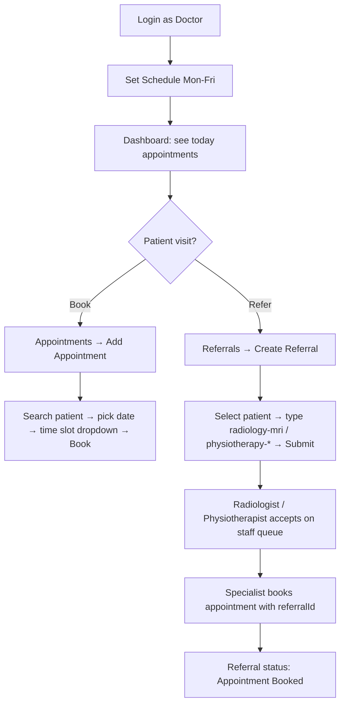
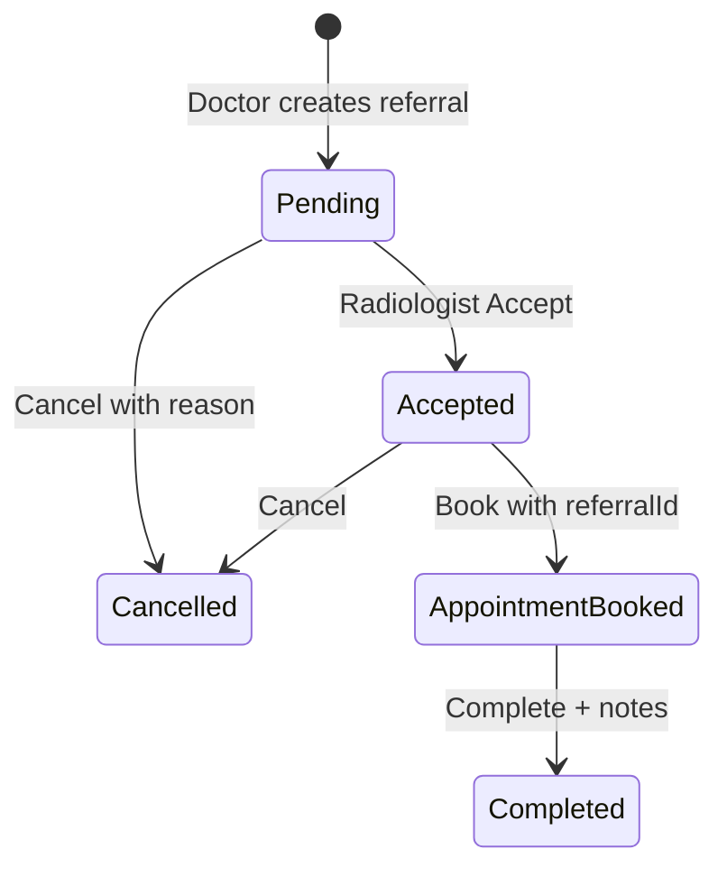

# BMD303 Hospital Information System — Frontend Workflow Guide

**Project:** CLINICSYSTEM (React + Vite)  
**Backend (dev):** `http://localhost:5000`  
**API docs:** `http://localhost:5000/swagger`  
**Override API URL:** set `VITE_API_BASE_URL` in `.env`

This document describes every major frontend route, who can access it, and how pages connect into end-to-end clinical workflows.

---

## Table of contents

1. [Architecture overview](#1-architecture-overview)
2. [User roles and login](#2-user-roles-and-login)
3. [Public marketing pages](#3-public-marketing-pages)
4. [Authentication pages](#4-authentication-pages)
5. [Doctor module](#5-doctor-module)
6. [Patient module](#6-patient-module)
7. [Nurse module](#7-nurse-module)
8. [Radiology module](#8-radiology-module)
9. [Physiotherapy module](#9-physiotherapy-module)
10. [Shared clinical workflows](#10-shared-clinical-workflows)
11. [Referral lifecycle](#11-referral-lifecycle)
12. [Appointment lifecycle](#12-appointment-lifecycle)
13. [Billing lifecycle](#13-billing-lifecycle)
14. [Key shared components](#14-key-shared-components)
15. [API services map](#15-api-services-map)
16. [Role permission matrix](#16-role-permission-matrix)

---

## 1. Architecture overview

```
┌─────────────────────────────────────────────────────────────┐
│  App.jsx (React Router)                                      │
│  ├── AuthProvider (JWT + user in localStorage)               │
│  ├── ReferralProvider (referral list cache)                    │
│  └── BillingProvider (invoices, services, payments)          │
└─────────────────────────────────────────────────────────────┘
         │
         ▼
┌─────────────────┐     ┌──────────────────┐
│ ProtectedRoute  │────▶│ Role layouts      │
│ (role gates)    │     │ Doctor / Patient  │
└─────────────────┘     │ Nurse / Physio    │
                        │ Radiology         │
                        └──────────────────┘
         │
         ▼
┌─────────────────────────────────────────────────────────────┐
│  Pages (route targets) + modals (BookAppointment, Referral…)   │
└─────────────────────────────────────────────────────────────┘
         │
         ▼
┌─────────────────────────────────────────────────────────────┐
│  apiClient (axios) → /api/* on backend                       │
│  apiUtils: unwrap ApiResponse { success, data }              │
└─────────────────────────────────────────────────────────────┘
```

| Layer | Location | Purpose |
|--------|----------|---------|
| Routes | `src/App.jsx` | All URLs and role protection |
| Auth | `src/context/AuthContext.jsx` | Login state, role flags |
| Referrals | `src/context/ReferralContext.jsx` | Shared referral data |
| Billing | `src/billing/BillingContext.jsx` | Invoices, services, payments |
| HTTP | `src/api/apiClient.js` | JWT on every request, 401 redirect |
| Utils | `src/utils/doctorUtils.js`, `appointmentUtils.js`, `referralUtils.js` | IDs, schedules, slots |

---

## 2. User roles and login

### Registerable roles (`Register.jsx`)

| Role | After register, navigates to |
|------|------------------------------|
| **Doctor** | `/doctor/dashboard` |
| **Patient** | `/patient/dashboard` |
| **Nurse** | `/nurse/dashboard` |
| **Physiotherapist** | `/physio/staff` |
| **Radiologist** | `/radiology/staff` |
| Admin / Staff | (registered if backend allows; no dedicated dashboard route in `Register.jsx`) |

### Auth storage

- `localStorage.token` — JWT for API
- `localStorage.user` — `{ userId, role, firstName, …, doctorId? }`
- Logout clears storage and sends user to `/login`

### Smart redirect

- `/dashboard` → Doctor, Patient, or Nurse home based on role; otherwise `/login`
- Wrong role on protected page → `/unauthorized`

---

## 3. Public marketing pages

No login required.

| Route | Page | Purpose |
|-------|------|---------|
| `/` | `Home` | Landing page |
| `/services` | `Services` | Clinic services overview |
| `/about` | `About` | About the hospital |
| `/patients` | `PatientsInfo` | Information for patients |
| `/contact` | `Contact` | Contact form / details |

**Workflow:** Visitor browses site → **Login** or **Register** to enter the clinical system.

---

## 4. Authentication pages

| Route | Page | Workflow |
|-------|------|----------|
| `/login` | `Login` | Email + password → JWT stored → redirect by role |
| `/register` | `Register` | Create account (role, phone, DOB, etc.) → auto-login → role dashboard |

**Notes:**

- Egyptian phone format may be required by backend (`01xxxxxxxxx`).
- Doctors may need specialization/license fields when backend validates them.

---

## 5. Doctor module

**Layout:** `DoctorLayout` (navbar + sidebar)  
**Protection:** `requireDoctor` on all `/doctor/*` routes (except cross-links to physio/radiology views)

### Sidebar navigation

| Menu | Route |
|------|-------|
| Dashboard | `/doctor/dashboard` |
| Appointments | `/doctor/appointments` |
| Patients | `/doctor/patients` |
| Consultations | `/doctor/consultations` |
| Prescriptions | `/doctor/prescriptions` |
| Medical Imaging | `/doctor/imaging` |
| Referrals | `/doctor/referrals` |
| Physiotherapy (link) | `/physio/dashboard` |
| Radiology (link) | `/radiology/dashboard` or `/radiology/staff` |
| Profile | `/doctor/profile` |

### Pages and workflows

| Route | Page | What happens |
|-------|------|----------------|
| `/doctor/dashboard` | `DoctorDashboard` | Today’s appointments, referrals, prescriptions summary; quick patient search; **Create referral** modal |
| `/doctor/appointments` | `Appointments` | Filter by date; view patient appointments; **Add appointment** (`BookAppointmentModal`) |
| `/doctor/patients` | `Patients` | Search/list patients; open patient record |
| `/doctor/patients/:patientId` | `PatientDetails` | Demographics, medical record, images, appointments (if API returns them); new consultation; upload imaging |
| `/doctor/schedule` | `Schedule` | Add/delete **working hours** (weekday, start/end, slot length) — drives available slots |
| `/doctor/profile` | `Profile` | Edit doctor profile |
| `/doctor/consultations` | `Consultations` | Consultation notes / visits |
| `/doctor/imaging` | `Imaging` | Medical images (X-ray, MRI, etc.) |
| `/doctor/referrals` | `Referrals` | List **own** referrals; create via `ReferralModal`; track status |
| `/doctor/prescriptions` | `DoctorPrescriptions` | Create/manage prescriptions |

### Typical doctor day (workflow)



---

## 6. Patient module

**Layout:** `PatientLayout` + `PatientSidebar`  
**Protection:** `requirePatient`

### Sidebar navigation

| Menu | Route |
|------|-------|
| Dashboard | `/patient/dashboard` |
| Appointments | `/patient/appointments` |
| Medical Records | `/patient/medical-records` |
| Billing | `/patient/billing` |
| Profile | `/patient/profile` |

*(Routes also exist for `/patient/prescriptions`, `/patient/invoices`, `/patient/payments` — use navbar/links or direct URL.)*

### Pages and workflows

| Route | Page | What happens |
|-------|------|----------------|
| `/patient/dashboard` | `PatientDashboard` | Overview / quick links |
| `/patient/appointments` | `PatientAppointments` | **Book** (self), **reschedule**, **cancel**; list from `GET /api/Appointments/my-appointments` |
| `/patient/medical-records` | `PatientMedicalRecords` | View own record |
| `/patient/profile` | `PatientProfile` | Personal info |
| `/patient/prescriptions` | `PatientPrescriptions` | View prescriptions |
| `/patient/billing` | `PatientBilling` | Billing summary |
| `/patient/invoices` | `PatientInvoices` | Invoice list |
| `/patient/payments` | `PatientPayments` | Payment history |

### Patient booking workflow

1. Go to **Appointments** → **Book Appointment**.
2. Select **doctor**, **date** (weekday matching doctor schedule), **time slot** (dropdown).
3. Submit → `POST /api/Appointments/book` (patient inferred from JWT if omitted).
4. Appointment appears in **My Appointments** and on the **doctor’s** appointment list for that date.

---

## 7. Nurse module

**Layout:** `NurseLayout` + `NurseSidebar`  
**Protection:** `requireNurse`

### Sidebar navigation

| Menu | Route |
|------|-------|
| Dashboard | `/nurse/dashboard` |
| Appointments | `/nurse/appointments` |
| Patients | `/nurse/patients` |
| Billing (submenu) | `/nurse/billing/*` |
| Schedule | `/nurse/schedule` |
| Profile | `/nurse/profile` |

### Pages and workflows

| Route | Page | What happens |
|-------|------|----------------|
| `/nurse/dashboard` | `NurseDashboard` | Operational overview |
| `/nurse/appointments` | `NurseAppointments` | Book/manage appointments for patients (`BookAppointmentModal`) |
| `/nurse/patients` | `NursePatients` | Patient list / support |
| `/nurse/schedule` | `NurseSchedule` | Nurse schedule (if used) |
| `/nurse/profile` | `NurseProfile` | Profile |
| `/nurse/billing/dashboard` | `BillingDashboard` | Billing KPIs |
| `/nurse/billing/invoices` | `BillingInvoices` | Create/view invoices (**Nurse/Admin only** — not Doctor) |
| `/nurse/billing/payments` | `BillingPayments` | Record payments |
| `/nurse/billing/services` | `BillingServices` | Price list / services |
| `/nurse/billing/reports` | `BillingReports` | Reports |
| `/nurse/billing/invoice/:id` | `InvoiceDetails` | Single invoice detail |

### Nurse workflow

- **Front desk:** book appointments for walk-in patients (search or register new patient in modal).
- **Billing:** after referral or visit, create invoice linked to `referenceType: Referral` or `Appointment`.
- Doctors **cannot** create invoices (403); they create referrals only.

---

## 8. Radiology module

Two UI tracks: **CLINIC staff queue** (integrated referrals) and **legacy/marketing radiology OS** pages.

### A. Staff queue (main clinical path) — requires **Radiologist**

| Route | Page | Workflow |
|-------|------|----------|
| `/radiology/staff` | `RadiologyStaffDashboard` | `ReferralStaffWorkQueue` — pending radiology referrals |
| `/radiology/schedule` | `Schedule` (shared) | Radiologist working hours |
| `/radiology/appointments` | `RadiologyAppointmentsPage` | Appointment list |
| `/radiology/services` | `RadiologyServicesPage` | Service catalog (marketing-style) |

**Staff queue actions (per referral row):**

| Status | Actions |
|--------|---------|
| **Pending** | Accept · Cancel |
| **Accepted** | Book appointment |
| **Appointment Booked** | Complete (notes required) |
| **Completed** / **Cancelled** | View only |

**Accept:** `PUT /api/Referrals/{id}/status` `{ "status": "Accepted" }` — **only Radiologist** (Doctor gets `INVALID_STATUS_TRANSITION`).

**Book:** `ReferralBookAppointmentModal` — uses **logged-in radiologist’s** `doctorId` + schedule; `POST /api/Appointments/book` with `referralId`.

### B. Doctor view of radiology

| Route | Page |
|-------|------|
| `/radiology/dashboard` | `RadiologyDashboard` — stats/list (doctor can open from sidebar) |

### C. Legacy / alternate radiology OS (mixed protection)

| Route | Page | Notes |
|-------|------|-------|
| `/radiology/login` | `RadiologyOsLogin` | Separate login UI |
| `/radiology/panel` | `RadiologyOsDashboard` | OS-style dashboard |
| `/radiology/patients` | `RadiologyPatients` | Patient list |
| `/radiology/studies` | `RadiologyStudies` | Studies |
| `/radiology/reports` | `RadiologyReports` | Reports |
| `/radiology/billing` | Placeholder | Not implemented |
| `/radiology/booking` | `RadiologyBookingPage` | Public-style booking flow |
| `/radiology/success` | `RadiologySuccessPage` | After booking |



---

## 9. Physiotherapy module

### A. Staff queue — requires **Physiotherapist**

| Route | Page | Workflow |
|-------|------|----------|
| `/physio/staff` | `PhysioStaffDashboard` | Same `ReferralStaffWorkQueue` as radiology, department = Physiotherapy |
| `/physio/schedule` | `Schedule` | Physiotherapist hours |
| `/physio/appointments` | `PhysioAppointmentsPage` | Appointments |
| `/physio/services` | `PhysioServicesPage` | Services |

Sidebar (Physio layout): Staff dashboard, Appointments, Schedule, Services.

### B. Doctor-linked physio view

| Route | Page |
|-------|------|
| `/physio/dashboard` | `PhysioDashboard` | Read-only referral stats (under `DoctorLayout` + login) |

### C. Physio portal shell (`/physio/*` with `PhysioAuthProvider`)

| Route | Page |
|-------|------|
| `/physio` | Redirects to `/physio/dashboard` (index) |
| `/physio/booking` | `PhysioBookingPage` |
| `/physio/success` | `PhysioSuccessPage` |
| `/physio/contact` | `PhysioContactPage` |
| `/physio/panel` | `PhysioAppDashboard` |
| `/physio/patients` | `PhysioPatientsPage` |
| `/physio/patients/:patientId` | `PhysioPatientDetail` |
| `/physio/treatment-plans` | `PhysioTreatmentPlansPage` |

**Referral types:** `physiotherapy-*` (e.g. `physiotherapy-knee`) assigned to **Physiotherapist** on backend.

---

## 10. Shared clinical workflows

### 10.1 Create referral (Doctor only)

**Where:** `DoctorDashboard`, `Referrals`, `ReferralModal`

1. Doctor searches/selects **patient** (`patientId` = clinical record id).
2. Sets `referralType`: `radiology-mri`, `radiology-xray`, `physiotherapy-…`, etc.
3. Urgency: `Routine` | `Urgent` | `Emergency` (PascalCase).
4. `POST /api/Referrals` with `doctorId` = referring doctor’s clinic id.
5. Optional: Nurse creates **invoice** for referral (`POST /api/billing/invoices`) — not done by Doctor in UI.

### 10.2 Book appointment (all roles)

**Component:** `BookAppointmentModal`

| Role | Patient selection | Doctor selection |
|------|-------------------|------------------|
| **Patient** | Self (auto) | Choose from doctor list |
| **Doctor / Nurse** | Search patients | Own doctor or selected doctor |
| **New patient** | Register inline | Same modal |

**Steps:**

1. Ensure **schedule** exists for that doctor (`/doctor/schedule` or specialist schedule).
2. Pick **date** on a configured weekday (Mon–Fri default hints).
3. Pick **time slot** from dropdown (`GET /api/Appointments/available-slots`).
4. `POST /api/Appointments/book` with `{ doctorId, patientId, timeSlotId, reasonForVisit?, referralId? }`.

**Visibility after book:**

- Patient → `/patient/appointments`
- Doctor → `/doctor/appointments` (by date)
- With `referralId` → referral → **Appointment Booked**

### 10.3 Specialist referral booking

**Component:** `ReferralBookAppointmentModal` on `/radiology/staff` and `/physio/staff`

- Uses **specialist’s** schedule (`resolveDoctorId` + `useStaffSchedule`), not referring doctor’s.
- Passes `referralId` so backend updates referral status.

---

## 11. Referral lifecycle

| Status | Meaning | Who advances |
|--------|---------|--------------|
| **Pending** | Created by doctor | — |
| **Accepted** | Specialist took case | Radiologist / Physiotherapist |
| **Appointment Booked** | Slot booked with `referralId` | Specialist (or system on book) |
| **Completed** | Treatment done | Specialist + completion notes |
| **Cancelled** | Stopped | Specialist or cancel with reason |

**API:**

- List doctor: `GET /api/Referrals/doctor/{doctorId}`
- List mine (specialist): `GET /api/Referrals/my-referrals` or `GET /api/Radiology/referrals` / `GET /api/Physio/referrals`
- Update: `PUT /api/Referrals/{id}/status`

---

## 12. Appointment lifecycle

| Status (typical) | Frontend surfaces |
|------------------|-------------------|
| Scheduled / Confirmed | Patient & doctor lists |
| CheckedIn / InProgress | Doctor/nurse views |
| Completed | Historical |
| Cancelled | Patient can cancel with reason |

**API:**

| Action | Endpoint |
|--------|----------|
| Available slots | `GET /api/Appointments/available-slots?doctorId&startDate&endDate` |
| Book | `POST /api/Appointments/book` |
| My list (patient) | `GET /api/Appointments/my-appointments` |
| Doctor list | `GET /api/Doctors/appointments?date=` or `GET /api/Appointments/doctor-appointments` |
| Cancel | `PUT /api/Appointments/cancel` |
| Reschedule | `PUT /api/Appointments/reschedule` |

**Critical IDs:**

- `doctorId` = row in **Doctors** table (not always `userId`).
- `patientId` = patient record id (`patientId` or `userId` from search — use `getPatientRecordId()`).

---

## 13. Billing lifecycle

**Context:** `BillingProvider` loads services, invoices, payments when user is logged in.

| Who | Can create invoices? | UI |
|-----|----------------------|-----|
| **Nurse / Admin** | Yes | `/nurse/billing/*` |
| **Doctor** | No (403) | Referral modal skips invoice step |
| **Patient** | View/pay | `/patient/billing`, invoices, payments |

Invoices link to clinical work via `referenceType` + `referenceId` (e.g. `Referral`, `Appointment`).

---

## 14. Key shared components

| Component | Used by | Purpose |
|-----------|---------|---------|
| `BookAppointmentModal` | Doctor, Nurse, Patient appointments | General booking + reschedule |
| `ReferralModal` | Doctor dashboard, Referrals page | Create referral |
| `ReferralStaffWorkQueue` | `/radiology/staff`, `/physio/staff` | Accept, book, complete referrals |
| `ReferralBookAppointmentModal` | Staff queue | Book with `referralId` |
| `UploadMedicalImageModal` | Patient details, Imaging | Upload studies |
| `ProtectedRoute` | All secured routes | Role gates |
| `ErrorBoundary` | Nurse appointments | Catch render errors |

---

## 15. API services map

| Service file | Main endpoints |
|--------------|----------------|
| `authService.js` | `/api/Auth/login`, `register`, profile |
| `doctorService.js` | `/api/Doctors`, profile, patients/search, schedule, appointments |
| `appointmentService.js` | `/api/Appointments/*` |
| `referralService.js` | `/api/Referrals/*`, `/api/Physio/referrals`, `/api/Radiology/referrals` |
| `medicalImageService.js` | Patient imaging upload/list |
| `billing/*` (via context) | `/api/billing/invoices`, services, payments |

All responses normalized through `unwrapList` / `unwrapApiResponse` in `apiUtils.js`.

---

## 16. Role permission matrix

| Action | Doctor | Patient | Nurse | Radiologist | Physiotherapist |
|--------|--------|---------|-------|-------------|-----------------|
| Create referral | Yes | No | No | No | No |
| Accept referral | No | No | No | Yes (radiology) | Yes (physio) |
| Book appointment (general) | Yes | Yes | Yes | Yes | Yes |
| Book referral appointment | No | No | No | Yes | Yes |
| Manage own schedule | Yes | No | Yes* | Yes | Yes |
| Create invoice | No | No | Yes | No | No |
| View own appointments | Yes | Yes | Yes | Yes | Yes |

\*Nurse schedule page exists; specialist schedules drive slot generation for radiology/physio staff.

---

## Quick reference: “I want to…”

| Goal | Go to |
|------|--------|
| Register a new patient | `/register` (role Patient) or Nurse/Doctor modal “Register new patient” |
| Doctor refers to MRI | `/doctor/referrals` → Create → type `radiology-mri` |
| Radiologist accepts & books | Login as Radiologist → `/radiology/staff` → Accept → Book appointment |
| Patient books orthopaedic visit | `/patient/appointments` → Book → pick doctor, date, slot |
| Set clinic hours | `/doctor/schedule` (or `/radiology/schedule`, `/physio/schedule`) |
| Bill a referral | Nurse → `/nurse/billing/invoices` |
| See today’s patients | `/doctor/dashboard` or `/doctor/appointments` |

---

## Folder structure (pages)

```
src/pages/
├── auth/          Login, Register
├── doctor/        Dashboard, Appointments, Patients, Schedule, Referrals, …
├── patient/       Dashboard, Appointments, Records, Billing, Profile
├── nurse/         Dashboard, Appointments, billing/*
├── radiology/     Staff dashboard, OS pages, booking, services
├── physio/        Staff dashboard, portal pages, booking
├── Home, Services, About, Contact, Patients (public)
```

---

*Document generated for the BMD303 Hospital Information System frontend. Update this file when new routes or workflows are added.*
