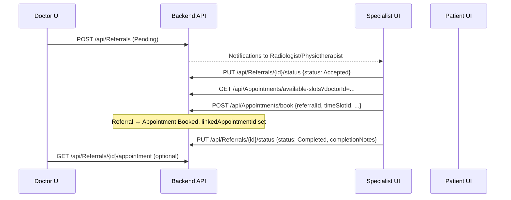

# Backend API Reference for Frontend Integration

**Project:** BMD303 Hospital Information System (CLINICSYSTEM)  
**Base URL (dev):** `http://localhost:5000`  
**Swagger (dev):** `http://localhost:5000/swagger`  
**JSON:** camelCase (`PropertyNamingPolicy.CamelCase`)

Use this document to wire the React/Vite frontend to the .NET backend.

---

## Table of contents

1. [Authentication](#1-authentication)
2. [Standard response shapes](#2-standard-response-shapes)
3. [ID types (critical for frontend)](#3-id-types-critical-for-frontend)
4. [Referrals — full workflow](#4-referrals--full-workflow)
5. [Appointments — full workflow](#5-appointments--full-workflow)
6. [Referrals + appointments together](#6-referrals--appointments-together)
7. [FHIR API (`/fhir`)](#7-fhir-api-fhir)
8. [FHIR via Referrals API (content negotiation)](#8-fhir-via-referrals-api-content-negotiation)
9. [Role-specific referral shortcuts](#9-role-specific-referral-shortcuts)
10. [WebSocket (external referral bridge)](#10-websocket-external-referral-bridge)
11. [All REST endpoints by controller](#11-all-rest-endpoints-by-controller)
12. [Referral status state machine](#12-referral-status-state-machine)
13. [Frontend checklists](#13-frontend-checklists)

---

## 1. Authentication

All endpoints except `POST /api/Auth/register`, `POST /api/Auth/login`, and `GET /fhir/metadata` require:

```http
Authorization: Bearer <JWT>
```

JWT settings (`appsettings.json`): issuer `ClinicAPI`, audience `ClinicApp`, expiry **120 minutes**.

### `POST /api/Auth/register`

| Field | Type | Notes |
|-------|------|-------|
| email | string | required |
| password | string | min 6 |
| firstName, lastName | string | required |
| phoneNumber | string | Egyptian format validated |
| role | string | `Doctor` \| `Nurse` \| `Admin` \| `Staff` \| `Patient` \| `Radiologist` \| `Physiotherapist` |
| specialization, licenseNumber | string? | doctor optional |
| department | string? | nurse optional |

**Response:** `AuthResponse` (not wrapped in `ApiResponse`)

```json
{
  "success": true,
  "token": "<jwt>",
  "user": {
    "userId": 1,
    "email": "...",
    "firstName": "...",
    "lastName": "...",
    "phoneNumber": "...",
    "role": "Doctor"
  },
  "message": null
}
```

### `POST /api/Auth/login`

Body: `{ "email", "password" }` → same `AuthResponse` shape.

### `GET /api/Auth/profile` `[Authorize]`

```json
{
  "userId": "1",
  "email": "...",
  "name": "...",
  "role": "Doctor"
}
```

**JWT claims used by backend:** `NameIdentifier` (= user id), `Email`, `Name`, `Role`.

---

## 2. Standard response shapes

### Wrapped (`ApiResponse`) — used by Referrals, Physio, Radiology, many others

```json
{
  "success": true,
  "message": "",
  "data": { }
}
```

Error (referrals):

```json
{
  "message": "Human readable",
  "code": "MACHINE_CODE"
}
```

### Unwrapped — Appointments controller (mostly)

| Endpoint | Success shape |
|----------|----------------|
| `GET available-slots` | **array** of `TimeSlotDTO` (no wrapper) |
| `POST book` | `{ "success": true, "data": AppointmentDTO }` |
| `PUT reschedule` | `{ "message": "Appointment rescheduled successfully" }` |
| `PUT cancel` | `{ "message": "Appointment cancelled successfully" }` |
| `GET my-appointments` | **array** of `AppointmentDTO` |
| `GET {id}` | single `AppointmentDTO` |
| `GET doctor-appointments` | **array** |
| `POST create` | `{ "success": true }` |

### Auth

Uses `AuthResponse` directly (see above).

### FHIR (`/fhir/*`)

Returns FHIR JSON models or `FhirOperationOutcome` on errors — **not** `ApiResponse`.

---

## 3. ID types (critical for frontend)

| ID | Meaning | Where used |
|----|---------|------------|
| **UserId** | ASP.NET Identity `UserModel.Id` | JWT `NameIdentifier`, `Auth` profile, booking as logged-in patient |
| **PatientId** | Row in `Patients` table (`PatientModel.PatientId`) | Referrals (`ReferralDTO.patientId`), appointments DB |
| **DoctorId** | Row in `Doctors` table (`DoctorModel.DoctorId`) | Referrals, schedules, doctor appointments |
| **PatientExternalId** | String e.g. `PAT-123` or custom `ExternalPatientId` | FHIR Patient refs, `GET /api/Referrals/patient/{patientExternalId}` |

**Create referral** accepts `patientId` and `doctorId` as **either** domain id **or** user id (service resolves both).

**Book appointment** `patientId` in body: when staff books, pass the patient's **UserId** (controller comment). Service resolves to `Patients.PatientId`.

**Patient "my referrals"** filter uses `PatientId` OR `PatientExternalId` = `PAT-{patientId}`.

---

## 4. Referrals — full workflow

### Domain model (`ReferralDTO`)

```typescript
interface ReferralDTO {
  id: number;              // alias for referralId
  referralId: number;
  patientId: number;
  patientName: string;
  patientExternalId: string;
  doctorId: number;
  doctorName: string;
  referralType: string;    // drives department (see below)
  department: string;      // Radiology | Physiotherapy | Doctor
  assignedToRole: string;  // Radiologist | Physiotherapist | Doctor
  urgency: string;         // Routine | Urgent | Emergency
  reason: string;
  notes?: string;
  status: string;          // see state machine
  linkedAppointmentId?: number;
  completionNotes?: string;
  cancellationReason?: string;
  reportAttached: boolean;
  fhirServiceRequestId?: string;  // e.g. "ServiceRequest/{guid}"
  createdDate: string;     // ISO UTC
  updatedAt: string;
}
```

### Referral type → department (set on create)

| `referralType` prefix | `department` | `assignedToRole` |
|----------------------|--------------|------------------|
| `radiology-*` | Radiology | Radiologist |
| `physiotherapy-*` | Physiotherapy | Physiotherapist |
| anything else | Doctor | Doctor |

Examples: `radiology-mri`, `physiotherapy-rehab`.

### Service: `ReferralService` (business logic)

| Method | What it does |
|--------|----------------|
| `CreateReferralAsync` | Validates doctor (role Doctor) and patient; sets status `Pending`; assigns department; generates `FhirServiceRequestId`; notifies all users with `assignedToRole` |
| `GetReferralByIdAsync` | Single DTO |
| `GetDoctorReferralsAsync` | By `doctorId` (domain), optional `status` filter |
| `GetPatientReferralsAsync` | By `patientExternalId` |
| `GetMyReferralsAsync` | Role-based list (see table below) |
| `UpdateReferralStatusAsync` | Validates transition + role; optional completion/cancel notes; notifies referring doctor |
| `GetReferralStatsAsync` | Counts by status/urgency/department for dashboard |
| `SendToExternalSystemAsync` | **No-op** (legacy) |

**Not called on create today:** `IReferralWebSocketClient.SendReferralAsync` — WebSocket client is registered but create flow does not push to external system.

### REST: `ReferralsController` — base `/api/Referrals`

| Method | Path | Roles | Body / query | Response |
|--------|------|-------|--------------|----------|
| POST | `/` | Doctor, Admin | `CreateReferralRequest` | `ApiResponse` + `ReferralDTO` |
| GET | `/{id}` | any authenticated | — | `ReferralDTO` |
| GET | `/doctor/{doctorId}` | Doctor, Admin | `?status=` | `ReferralDTO[]` |
| GET | `/my-referrals` | any authenticated | `?status=` | `ReferralDTO[]` (role-filtered) |
| GET | `/patient/{patientExternalId}` | any authenticated | — | `ReferralDTO[]` |
| PUT | `/{id}/status` | Doctor, Admin, Physiotherapist, Radiologist, Nurse | `UpdateReferralStatusRequest` | updated `ReferralDTO` |
| POST | `/{id}/send` | Doctor, Admin | — | **410 Gone** (deprecated) |
| GET | `/{id}/appointment` | Doctor, Physiotherapist, Radiologist, Nurse | — | `AppointmentDTO` if linked |
| GET | `/stats` | Doctor, Nurse, Physiotherapist, Radiologist | — | `ReferralStatsDTO` |

#### `CreateReferralRequest`

```json
{
  "patientId": 2,
  "doctorId": 1,
  "referralType": "physiotherapy-rehab",
  "urgency": "Routine",
  "reason": "Post-op rehab",
  "notes": "optional"
}
```

#### `UpdateReferralStatusRequest`

```json
{
  "status": "Accepted",
  "completionNotes": "required when status=Completed",
  "cancellationReason": "required when status=Cancelled"
}
```

#### `ReferralStatsDTO`

```json
{
  "total": 10,
  "pending": 3,
  "accepted": 2,
  "appointmentBooked": 2,
  "completed": 2,
  "cancelled": 1,
  "byUrgency": { "emergency": 1, "urgent": 2, "routine": 7 },
  "byDepartment": { "Radiology": 5, "Physiotherapy": 3 }
}
```

### `GetMyReferralsAsync` filtering by role

| Role | Query filter |
|------|----------------|
| Doctor | `doctorId` = domain id for current user |
| Physiotherapist | `assignedToRole == Physiotherapist` |
| Radiologist | `assignedToRole == Radiologist` |
| Patient | `patientId` or `patientExternalId == PAT-{id}` |
| Nurse | **all** referrals |
| Other | empty list |

Physio/Radiologist lists sorted: Emergency → Urgent → Routine, then newest first.

### Business error codes (referrals)

| Code | When |
|------|------|
| `DOCTOR_NOT_FOUND` | Invalid doctor on create |
| `PATIENT_NOT_FOUND` | Invalid patient on create |
| `COMPLETION_NOTES_REQUIRED` | Complete without notes |
| `CANCELLATION_REASON_REQUIRED` | Cancel without reason |
| `INVALID_STATUS_TRANSITION` | Illegal status change for role |
| `REFERRAL_NOT_FOUND` | GET by id |
| `REFERRAL_CREATE_FAILED` | Unhandled create failure |

---

## 5. Appointments — full workflow

### Models

**TimeSlotDTO**

```typescript
{
  timeSlotId: number;
  slotDate: string;      // date
  startTime: string;     // TimeSpan → "HH:mm:ss"
  endTime: string;
  status: "Available" | "Booked" | ...
}
```

**AppointmentDTO**

```typescript
{
  appointmentId: number;
  patientId?: number;    // often user id in list views
  doctorId?: number;
  doctorName: string;
  patientName: string;   // often empty in API responses
  appointmentDate: string;
  startTime: string;
  endTime: string;
  status: "Scheduled" | "Cancelled" | ...
  reasonForVisit?: string;
}
```

### Service: `AppointmentService`

| Method | Logic |
|--------|--------|
| `GetAvailableSlotsAsync` | Slots where `schedule.doctorId` matches, date range, `status == Available` |
| `BookAppointmentAsync` | Validates slot available & not in past; optional referral link; marks slot `Booked`; creates appointment |
| `RescheduleAppointmentAsync` | Patient only; frees old slot, books new |
| `CancelAppointmentAsync` | Sets `Cancelled`, frees slot, stores reason |
| `GetPatientAppointmentsAsync` | By identity userId → resolves patient profile |
| `GetAppointmentDetailsAsync` | By appointment id |
| `GetDoctorAppointmentsAsync` | By doctor domain id, optional date |
| `CreateAppointmentAsync` | Doctor creates for patient (legacy path; uses patientId param as **patient table id** in implementation — verify ids when integrating) |

### Referral-linked booking rules (`BookAppointmentAsync`)

1. If `referralId` provided:
   - Referral must exist and `status === "Accepted"`.
   - Current user's role must equal `referral.assignedToRole` (Physiotherapist books physio referral, etc.).
2. On success:
   - Referral → `Appointment Booked`
   - `linkedAppointmentId` = new appointment id
   - Notification to referring doctor

### REST: `AppointmentsController` — base `/api/Appointments`

| Method | Path | Roles | Notes |
|--------|------|-------|-------|
| GET | `/available-slots` | authenticated | Query: `doctorId`, `startDate`, `endDate` (defaults: today → +30 days) |
| POST | `/book` | Patient, Doctor, Physiotherapist, Radiologist | Body: `BookAppointmentRequest` |
| PUT | `/reschedule` | Patient | `RescheduleAppointmentRequest` |
| PUT | `/cancel` | Patient, Doctor | `CancelAppointmentRequest` |
| GET | `/my-appointments` | Patient | List for logged-in patient |
| GET | `/{appointmentId}` | authenticated | Details |
| GET | `/doctor-appointments` | Doctor | `?date=` optional |
| POST | `/create` | Doctor | `CreateAppointmentRequest` |

#### `BookAppointmentRequest`

```json
{
  "doctorId": 1,
  "patientId": 5,
  "timeSlotId": 42,
  "reasonForVisit": "Follow-up",
  "referralId": 10
}
```

- **Patient** booking: omit `patientId` (uses JWT user id).
- **Physio/Radiologist** booking for referral: include `referralId`, must be `Accepted`; role must match referral.

---

## 6. Referrals + appointments together

### End-to-end flow (frontend sequence)



| Step | Actor | API | Referral status after |
|------|-------|-----|------------------------|
| 1 | Doctor | `POST /api/Referrals` | `Pending` |
| 2 | Radiologist / Physiotherapist | `PUT .../status` → `Accepted` | `Accepted` |
| 3 | Same specialist | `GET available-slots` + `POST book` with `referralId` | `Appointment Booked` |
| 4 | Specialist | `PUT .../status` → `Completed` + notes | `Completed` |
| Cancel (pending) | Nurse or referring Doctor | `PUT .../status` → `Cancelled` + reason | `Cancelled` |
| Cancel (after accept) | Specialist | `Cancelled` + reason | `Cancelled` |

Alternate read paths:

- `GET /api/Referrals/{id}/appointment` → linked `AppointmentDTO`
- `GET /api/Referrals/my-referrals?status=Accepted` → work queue for specialist

---

## 7. FHIR API (`/fhir`)

**Base:** `/fhir`  
**Content-Type:** `application/fhir+json`  
**Auth:** JWT required except `GET /fhir/metadata`

Implementation: `FhirController` + `FhirService` (maps DB entities → custom FHIR POCOs in `Models/FHIR/`).

### Capability

`GET /fhir/metadata` `[AllowAnonymous]` → `FhirCapabilityStatement` (lists Patient, Practitioner, Condition, CarePlan, ServiceRequest, Appointment, Observation).

### Resources

| Resource | GET by id | Search |
|----------|-----------|--------|
| Patient | `/fhir/Patient/{externalId}` | `/fhir/Patient?identifier=&name=` |
| Practitioner | `/fhir/Practitioner/{id}` | `/fhir/Practitioner?name=&specialization=` |
| Condition | `/fhir/Condition/condition-{consultationId}` | `/fhir/Condition?patient={externalId}` **required** |
| CarePlan | `/fhir/CarePlan/{id}` | `/fhir/CarePlan?patient=&status=` **patient required** |
| ServiceRequest | `/fhir/ServiceRequest/{id}` | `/fhir/ServiceRequest?patient=&status=` OR `?practitioner=&status=` OR all |
| Appointment | `/fhir/Appointment/{id}` | `/fhir/Appointment?patient=&date=` OR `?practitioner=&date=` |
| Observation | — | `/fhir/Observation?patient=&category=` |
| Observation (encounter) | — | `/fhir/Observation/encounter/{consultationId}` |

**ServiceRequest id:** numeric referral id OR `FhirServiceRequestId` string.

**Errors:** `FhirOperationOutcome` with `issue[].severity`, `code`, `details_text`.

### Internal ↔ FHIR status mapping (`ReferralToFhirMapper`)

| Internal status | FHIR ServiceRequest.status |
|-----------------|----------------------------|
| Pending | draft |
| Accepted, Appointment Booked | active |
| Completed | completed |
| Cancelled | revoked |

| Internal urgency | FHIR priority |
|------------------|---------------|
| Routine | routine |
| Urgent | urgent |
| Emergency | stat |

---

## 8. FHIR via Referrals API (content negotiation)

On `/api/Referrals/*` GET endpoints, if request header:

```http
Accept: application/fhir+json
```

Response is HL7 FHIR R4 **ServiceRequest** (single) or **Bundle** (list), serialized via `ReferralToFhirMapper` + `Hl7.Fhir.Serialization`.

| Endpoint | FHIR output |
|----------|-------------|
| GET `/{id}` | one `ServiceRequest` |
| GET `/doctor/{id}`, `/my-referrals`, `/patient/{extId}` | `Bundle` type `searchset` |

Default `Accept: application/json` → `ApiResponse` + `ReferralDTO`.

---

## 9. Role-specific referral shortcuts

These wrap `GetMyReferralsAsync` with `ApiResponse`:

| Controller | Base | Referrals endpoint |
|------------|------|-------------------|
| Physio | `/api/Physio` | `GET /referrals?status=` |
| Radiology | `/api/Radiology` | `GET /referrals?status=` |

Both also expose patients, appointments, dashboards, and role-specific clinical data (treatment plans, imaging studies, etc.) — see section 11.

---

## 10. WebSocket (external referral bridge)

**Config section:** `ReferralWebSocket` in `appsettings.json`

| Setting | Purpose |
|---------|---------|
| EndpointUrl | e.g. `ws://127.0.0.1:8000/ws/referrals?token=...` |
| JwtToken / JwtTokenFilePath | Auth to external Python/ws server |
| HeartbeatIntervalSeconds | keepalive |
| AcknowledgementTimeoutSeconds | wait for ack |
| MaxSendAttempts | retry count |

**Service:** `ReferralWebSocketClientService` implements `IReferralWebSocketClient.SendReferralAsync(ReferralData)`.

**Payload shape** (`ReferralWebSocketDTOs`):

```json
{
  "event": "referral.created",
  "timestamp": "...",
  "source": "dotnet-system",
  "data": {
    "referral_id": "...",
    "patient": { "name", "phone", "email", "date_of_birth" },
    "referring_doctor": "...",
    "service_requested": "...",
    "doctor_notes": "...",
    "priority": "routine|urgent|stat",
    "created_at": "..."
  }
}
```

**Important for frontend:**

- WebSocket is **server-to-server** (backend outbound). Frontend does **not** connect to this socket for normal flows.
- `AddHostedService` for the WebSocket worker is **commented out** in `Program.cs` — background loop may not run unless re-enabled.
- `POST /api/Referrals/{id}/send` returns **410 Gone**.
- Creating a referral does **not** currently call the WebSocket client.

---

## 11. All REST endpoints by controller

Prefix: `/api/{Controller}` unless noted. `[Authorize]` on all unless stated.

### Auth — `/api/Auth`

| Method | Path | Auth | Body |
|--------|------|------|------|
| POST | register | none | RegisterRequest |
| POST | login | none | LoginRequest |
| GET | profile | JWT | — |

### Appointments — `/api/Appointments`

(See section 5.)

### Referrals — `/api/Referrals`

(See section 4.)

### FHIR — `/fhir`

(See section 7.)

### Doctors — `/api/Doctors` `[Doctor]`

| GET | `/` | list doctors |
| GET | `/profile` | own profile |
| PUT | `/profile` | update |
| GET | `/appointments/today` | today's appointments |
| GET | `/appointments` | appointments |
| GET | `/patients/{patientId}` | patient detail |
| GET | `/patients/search` | search |
| GET | `/patients/{patientId}/images` | images |
| POST | `/schedule` | create schedule |
| GET | `/schedule` | get schedule |
| DELETE | `/schedule/{scheduleId}` | delete schedule |

### Patients — `/api/Patients` `[Patient]`

| GET/PUT | `/profile` |
| GET/PUT | `/medical-history` |
| GET | `/appointments` |
| GET | `/prescriptions` |
| POST | `/medical-images/upload` |
| GET | `/medical-images` |
| GET | `/dashboard-stats` |

### Consultations — `/api/Consultations`

| POST | `/start` |
| PUT | `/{consultationId}` |
| PUT | `/{consultationId}/end` |
| GET | `/{consultationId}` |
| GET | `/patient/history` |
| GET | `/doctor/patient-history/{patientId}` |

### Prescriptions — `/api/Prescriptions`

| POST | `/` |
| POST | `/bulk` |
| GET | `/my-prescriptions` |
| GET | `/{prescriptionId}` |
| GET | `/{prescriptionId}/pdf` |
| POST | `/{prescriptionId}/send` |

### Notifications — `/api/Notifications`

| GET | `/` |
| PUT | `/{notificationId}/read` |
| DELETE | `/{notificationId}` |
| POST | `/appointment-reminder/{appointmentId}` |

### Billing — `/api/Billing`

| GET/POST | `/services` |
| PATCH | `/services/{id}`, `/services/{id}/toggle` |
| GET/POST | `/invoices` |
| GET | `/invoices/{id}` |
| PATCH | `/invoices/{id}`, `/invoices/{id}/cancel` |
| GET/POST | `/payments` |

### MedicalImages — `/api/MedicalImages`

| POST | `/upload/{patientId}` |
| GET | `/` |
| GET | `/{imageId}/download` |

### Physio — `/api/Physio` `[Physiotherapist]`

| GET | `/referrals`, `/patients`, `/patients/{patientId}`, `/appointments`, `/treatment-plans`, `/treatment-plans/{id}`, `/dashboard`, `/staff` |
| POST | `/treatment-plans` |
| PUT | `/treatment-plans/{id}` |

### Radiology — `/api/Radiology` `[Radiologist]`

| GET | `/referrals`, `/patients`, `/patients/{patientId}`, `/studies`, `/studies/{id}`, `/reports`, `/reports/{id}`, `/appointments`, `/dashboard`, `/staff` |
| POST | `/studies`, `/reports` |
| PUT | `/studies/{id}`, `/reports/{id}` |

### Nurse — `/api/Nurse` `[Nurse]`

| GET | `/dashboard`, `/appointments`, `/patients`, `/schedule` |

---

## 12. Referral status state machine

```
                    ┌─────────────┐
                    │   Pending   │
                    └──────┬──────┘
           Accept (Physio/Rad) │ Cancel (Nurse, or Doctor who owns referral)
                    ┌─────────▼─────────┐
                    │     Accepted      │
                    └─────────┬─────────┘
         Book appt (auto)     │ Cancel (Physio/Rad)
                    ┌─────────▼─────────┐
                    │ Appointment Booked│
                    └─────────┬─────────┘
              Complete (Physio/Rad + completionNotes)
                    ┌─────────▼─────────┐
                    │    Completed      │
                    └───────────────────┘

Any non-terminal → Cancelled (with rules above)
Terminal: Completed, Cancelled (no further transitions)
```

| From | To | Who |
|------|-----|-----|
| Pending | Accepted | Physiotherapist, Radiologist |
| Pending | Cancelled | Nurse; Doctor (if `referral.doctorId` matches) |
| Accepted | Appointment Booked | **Automatic** on `POST /appointments/book` with valid `referralId` |
| Accepted | Cancelled | Physiotherapist, Radiologist |
| Appointment Booked | Completed | Physiotherapist, Radiologist (+ `completionNotes`) |

---

## 13. Frontend checklists

### Axios/fetch setup

```typescript
const api = axios.create({
  baseURL: 'http://localhost:5000',
  headers: { Authorization: `Bearer ${token}` },
});

// Referrals list
const referrals = await api.get('/api/Referrals/my-referrals', {
  params: { status: 'Pending' },
});
// referrals.data.data = ReferralDTO[]

// Book referral appointment (physio)
await api.post('/api/Appointments/book', {
  doctorId: selectedDoctorId,
  timeSlotId: slot.timeSlotId,
  referralId: referral.referralId,
  reasonForVisit: 'Referral visit',
});
```

### Doctor referral create screen

1. Resolve `doctorId` (domain id from doctor profile if needed).
2. `POST /api/Referrals` with `referralType` prefix `radiology-` or `physiotherapy-`.
3. Poll or subscribe to `GET /api/Notifications` for acceptance updates.

### Specialist work queue

1. `GET /api/Referrals/my-referrals?status=Pending` (or `/api/Physio/referrals`).
2. `PUT /api/Referrals/{id}/status` → `{ "status": "Accepted" }`.
3. Load slots → book with `referralId`.
4. After visit → `PUT` → `{ "status": "Completed", "completionNotes": "..." }`.

### Patient view

- Referrals: `GET /api/Referrals/my-referrals` (role Patient).
- Appointments: `GET /api/Appointments/my-appointments` or `GET /api/Patients/appointments`.

### FHIR client (optional)

- Metadata: `GET /fhir/metadata` (no auth).
- Referral as ServiceRequest: `GET /fhir/ServiceRequest/{referralId}` with JWT.
- Or `GET /api/Referrals/{id}` with `Accept: application/fhir+json`.

### Do not use

- `POST /api/Referrals/{id}/send` — returns 410.
- Assuming `npm` at repo root for frontend — use `BMD303-Hospital-Information-System-frontend` folder for `package.json`.

---

## File map (backend source)

| Area | Files |
|------|--------|
| Referrals API | `Controllers/ReferralsController.cs` |
| Referrals logic | `Services/ReferralService.cs`, `Services/IReferralService.cs` |
| Appointments API | `Controllers/AppointmentsController.cs` |
| Appointments logic | `Services/AppointmentService.cs` |
| FHIR API | `Controllers/FhirController.cs` |
| FHIR mapping | `Services/FhirService.cs`, `Mappers/ReferralToFhirMapper.cs` |
| DTOs | `Data/DTOs/ReferralDTOs.cs`, `AppointmentDTOs.cs`, `FhirDTOs.cs` |
| WebSocket | `Services/ReferralWebSocketClientService.cs`, `Data/DTOs/ReferralWebSocketDTOs.cs` |
| Model | `Models/ReferralModel.cs` |

---

*Generated for frontend integration. Backend runs on port 5000; seed password `Hospital@123!` when using default `DataSeeder`.*
