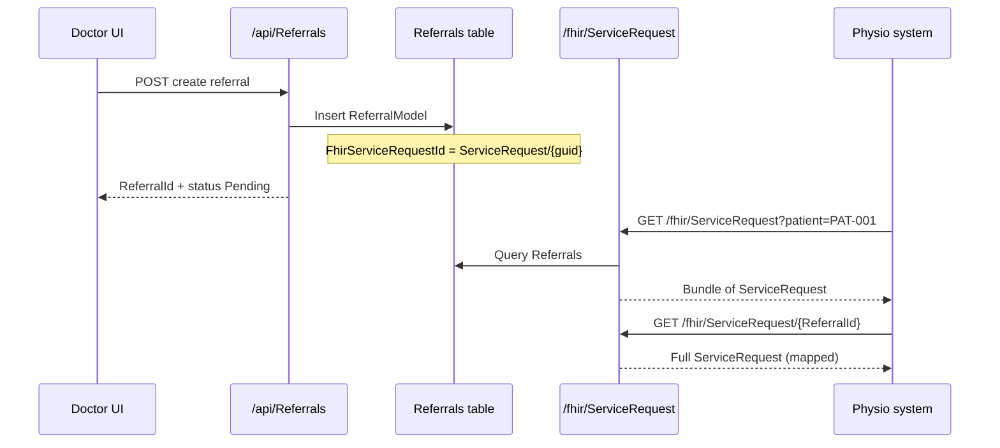

# FHIR Endpoints and Mappings — Full Implementation Reference

**Project:** Clinic Management System (Hospital-backend)  
**FHIR version:** R4 (4.0.1)  
**Spec reference:** [HL7 FHIR R4](http://hl7.org/fhir/R4/)  
**Local base URL:** `http://localhost:5000/fhir`  
**Content-Type:** `application/fhir+json`  
**Last updated:** May 2026 (generated from codebase)

---

## Table of contents

1. [Architecture](#1-architecture)
2. [Authentication](#2-authentication)
3. [Endpoint catalog](#3-endpoint-catalog)
4. [Resource mappings (domain → FHIR)](#4-resource-mappings-domain--fhir)
5. [Referral ↔ ServiceRequest mapper](#5-referral--servicerequest-mapper)
6. [Status and code value maps](#6-status-and-code-value-maps)
7. [Identifiers and references](#7-identifiers-and-references)
8. [Referral lifecycle and FHIR IDs](#8-referral-lifecycle-and-fhir-ids)
9. [Source files](#9-source-files)
10. [Integration examples](#10-integration-examples)
11. [Limitations and notes](#11-limitations-and-notes)

---

## 1. Architecture

```
┌─────────────────┐     JWT Bearer      ┌──────────────────┐
│ External client │ ──────────────────► │  FhirController  │
│ (Physio, etc.)  │   /fhir/*           │  Route: /fhir    │
└─────────────────┘                     └────────┬─────────┘
                                                 │
                                                 ▼
                                        ┌──────────────────┐
                                        │   IFhirService   │
                                        │   FhirService    │
                                        └────────┬─────────┘
                                                 │
                    ┌────────────────────────────┼────────────────────────────┐
                    ▼                            ▼                            ▼
            ClinicDbContext              ReferralToFhirMapper          Hl7.Fhir.Model
            (EF Core)                    (ServiceRequest only)         (Firely SDK)
                    │
    Patients, Doctors, Consultations, Referrals, Appointments,
    TherapyPlans, TimeSlots
```

| Layer | Responsibility |
|--------|----------------|
| **`FhirController`** | HTTP routing, query params, `Bundle` / `OperationOutcome` wrappers, capability statement |
| **`FhirService`** | Load domain entities, map to FHIR POCOs, search/filter |
| **`ReferralToFhirMapper`** | Bidirectional **ReferralModel** ↔ **Hl7.Fhir.Model.ServiceRequest** (extends as `Models.FHIR.FhirServiceRequest`) |
| **`Models/FHIR/*`** | JSON-serializable FHIR-shaped DTOs (most resources) |
| **`Data/DTOs/FhirDTOs.cs`** | `FhirBundle`, `FhirOperationOutcome`, `FhirCapabilityStatement` |

**Registration** (`Program.cs`):

```csharp
builder.Services.AddScoped<IFhirService, FhirService>();
```

**Configuration** (`appsettings.json` → `Fhir` section):

| Key | Default | Purpose |
|-----|---------|---------|
| `BaseUrl` | `https://api.clinic-system.com/fhir` | Documented canonical URL (used in mapper constants; controller uses `/fhir`) |
| `Version` | `4.0.1` | FHIR version |
| `Format` | `json` | Serialization format |
| `Publisher` | `Clinic Management System` | Capability statement metadata |

---

## 2. Authentication

| Endpoint | Auth |
|----------|------|
| `GET /fhir/metadata` | **Anonymous** (`[AllowAnonymous]`) |
| All other `/fhir/*` routes | **JWT required** (`[Authorize]` on controller) |

Obtain a token:

```http
POST /api/Auth/login
Content-Type: application/json

{
  "email": "dr.ahmed.nabil@clinic.com",
  "password": "Hospital@123!"
}
```

Use on FHIR calls:

```http
GET /fhir/Patient/PAT-0001
Authorization: Bearer <token>
Accept: application/fhir+json
```

Errors use **`OperationOutcome`** (see `FhirDTOs.FhirOperationOutcome`):

| HTTP | severity | code | When |
|------|----------|------|------|
| 400 | error | required / invalid | Missing `patient`, bad Condition id format |
| 404 | error | not-found | Resource missing |
| 500 | fatal | exception | Unhandled server error |

---

## 3. Endpoint catalog

Base path: **`/fhir`** (not `/api/fhir`).

### 3.1 Capability / metadata

| Method | Path | Auth | Description |
|--------|------|------|-------------|
| `GET` | `/fhir/metadata` | No | Returns `CapabilityStatement` listing supported types: Patient, Practitioner, Condition, CarePlan, ServiceRequest, Appointment, Observation |

Supported interactions (read + search-type only; **no create/update/delete** on FHIR API):

| FHIR type | Search parameters |
|-----------|-------------------|
| Patient | `identifier`, `name` |
| Practitioner | `name` (+ `specialization` in implementation, not in capability list) |
| Condition | `patient` |
| CarePlan | `patient`, `status`, `date` |
| ServiceRequest | `patient`, `status`, `priority` |
| Appointment | `patient`, `practitioner`, `date` |
| Observation | `patient`, `category`, `date` |

---

### 3.2 Patient

| Method | Path | Query / path params | Response |
|--------|------|---------------------|----------|
| `GET` | `/fhir/Patient/{id}` | `id` = `Patient.ExternalPatientId` (e.g. `PAT-0001`) | `FhirPatient` |
| `GET` | `/fhir/Patient` | `identifier`, `name` (optional) | `Bundle<FhirPatient>` |

**Service:** `GetPatientByIdAsync`, `SearchPatientsAsync`  
**Source table:** `Patients`

---

### 3.3 Practitioner

| Method | Path | Query / path params | Response |
|--------|------|---------------------|----------|
| `GET` | `/fhir/Practitioner/{id}` | `id` = **User.Id** (integer) for users with `Role == "Doctor"` | `FhirPractitioner` |
| `GET` | `/fhir/Practitioner` | `name`, `specialization` (optional) | `Bundle<FhirPractitioner>` |

**Service:** `GetPractitionerByIdAsync`, `SearchPractitionersAsync`  
**Source:** `Users` + `Doctors` (must have `Doctors` row linked to user)

> **Important:** Appointment participants reference `Practitioner/{DoctorId}` where `DoctorId` is the **`Doctors.DoctorId`** FK, not `Users.Id`. Search/read by practitioner in appointments uses **doctor table id**; read practitioner by id uses **user id**. Integrators should treat this carefully (see [§11](#11-limitations-and-notes)).

---

### 3.4 Condition (diagnosis from consultation)

| Method | Path | Query / path params | Response |
|--------|------|---------------------|----------|
| `GET` | `/fhir/Condition/{id}` | `id` must be `condition-{consultationId}` | `FhirCondition` |
| `GET` | `/fhir/Condition` | `patient` = **required** (`PatientExternalId`) | `Bundle<FhirCondition>` |

**Service:** `GetConditionByConsultationIdAsync`, `GetConditionsByPatientAsync`  
**Source:** `Consultations` (only rows with non-empty `Diagnosis`), joined via `Appointment.PatientExternalId`

---

### 3.5 CarePlan (therapy plan)

| Method | Path | Query / path params | Response |
|--------|------|---------------------|----------|
| `GET` | `/fhir/CarePlan/{id}` | `id` = `TherapyPlanId` | `FhirCarePlan` |
| `GET` | `/fhir/CarePlan` | `patient` = **required**; `status` optional | `Bundle<FhirCarePlan>` |

**Service:** `GetCarePlanByIdAsync`, `GetCarePlansByPatientAsync`  
**Source:** `TherapyPlans` + `Referral.PatientExternalId`  
**Also available (service only, no dedicated route):** `GetCarePlansByReferralAsync(referralId)`

---

### 3.6 ServiceRequest (referral)

| Method | Path | Query / path params | Response |
|--------|------|---------------------|----------|
| `GET` | `/fhir/ServiceRequest/{id}` | Numeric `ReferralId` **or** `FhirServiceRequestId` / GUID fragment | `FhirServiceRequest` (Hl7.Fhir `ServiceRequest` subclass) |
| `GET` | `/fhir/ServiceRequest` | One of: `patient`, `practitioner` (doctor id), or neither → all referrals; `status` optional | `Bundle<FhirServiceRequest>` |

**Service:** `GetServiceRequestByIdAsync`, `GetServiceRequestByFhirIdAsync`, `GetServiceRequestsByPatientAsync`, `GetServiceRequestsByPractitionerAsync`, `GetAllServiceRequestsAsync`  
**Source:** `Referrals`  
**Mapping:** `ReferralToFhirMapper.ToFhirServiceRequest`

---

### 3.7 Appointment

| Method | Path | Query / path params | Response |
|--------|------|---------------------|----------|
| `GET` | `/fhir/Appointment/{id}` | `id` = `AppointmentId` | `FhirAppointment` |
| `GET` | `/fhir/Appointment` | **Either** `patient` **or** `practitioner` required; `date` optional (defaults to UTC today, window +1 day) | `Bundle<FhirAppointment>` |

**Service:** `GetAppointmentByIdAsync`, `GetAppointmentsByPatientAsync`, `GetAppointmentsByPractitionerAsync`  
**Source:** `Appointments` + `TimeSlots` + `Doctor.User`

---

### 3.8 Observation

| Method | Path | Query / path params | Response |
|--------|------|---------------------|----------|
| `GET` | `/fhir/Observation` | `patient` = **required**; `category` optional (filtered in code path; implementation builds from consultations) | `Bundle<FhirObservation>` |
| `GET` | `/fhir/Observation/encounter/{encounterId}` | `encounterId` = `ConsultationId` | `Bundle<FhirObservation>` |

**Service:** `GetObservationsByPatientAsync`, `GetObservationsByEncounterAsync`  
**Source:** Derived from `Consultations` (diagnosis → LOINC 11476-4; symptoms → LOINC 75325-1 on encounter route)

> There is **no** `GET /fhir/Observation/{id}` single-resource route.

---

## 4. Resource mappings (domain → FHIR)

### 4.1 Patient (`PatientModel` → `FhirPatient`)

| Domain field | FHIR field | Notes |
|--------------|------------|--------|
| `ExternalPatientId` | `id` | Primary FHIR logical id |
| `ExternalPatientId` | `identifier[0].value` | System: `https://clinic-system.com/patient-id` |
| `FullName` | `name[0].text`, `given`, `family` | Split on first/last space (simple) |
| `PhoneNumber` | `telecom` (phone, mobile) | Omitted if empty |
| — | `active` | Always `true` |
| `UpdatedAt` | `meta_lastUpdated` | |

**Not mapped:** `Gender`, `DateOfBirth`, `Address` (fields exist on `FhirPatient` but mapper does not populate them).

---

### 4.2 Practitioner (`UserModel` + `DoctorModel` → `FhirPractitioner`)

| Domain field | FHIR field | Notes |
|--------------|------------|--------|
| `User.Id` | `id` | Used in `GET /Practitioner/{id}` |
| `User.Id` | `identifier[0].value` | System: `https://clinic-system.com/practitioner-id` |
| `Doctor.LicenseNumber` | `identifier[1].value` | System: `https://clinic-system.com/license-number` |
| `Doctor.IsActive` | `active` | |
| `User.FirstName`, `LastName` | `name[0].given`, `family` | |
| `User.PhoneNumber` | `telecom` (work) | |
| `Doctor.Specialization` | `qualification[0].code` | HL7 v2-0360 style coding |

---

### 4.3 Condition (`ConsultationModel` → `FhirCondition`)

| Domain field | FHIR field | Notes |
|--------------|------------|--------|
| `ConsultationId` | `id` | Format: `condition-{ConsultationId}` |
| `ConsultationId` | `identifier[0].value` | System: `https://clinic-system.com/consultation-id` |
| `Status` | `clinicalStatus` | `Completed` → `resolved`, else `active` |
| — | `verificationStatus` | Fixed `confirmed` |
| `Diagnosis` | `code.text`, `code.coding[0].display` | No SNOMED/ICD code assignment |
| `Appointment.PatientExternalId` | `subject.reference` | `Patient/{externalId}` |
| `AppointmentId` | `encounter.reference` | `Encounter/{AppointmentId}` |
| `ConsultationDate` | `recordedDate` | `yyyy-MM-dd` |
| `Notes` | `note` | |

---

### 4.4 CarePlan (`TherapyPlanModel` → `FhirCarePlan`)

| Domain field | FHIR field | Notes |
|--------------|------------|--------|
| `TherapyPlanId` | `id` | |
| `TherapyPlanId` | `identifier[0].value` | System: `https://clinic-system.com/therapy-plan-id` |
| `Status` | `status` | See [§6.3](#63-careplan-status) |
| — | `intent` | `plan` |
| `TherapyType` | `category.text`, coding display | US Core careplan-category style |
| `PlanName` | `title` | |
| `Goals` | `description` | |
| `Referral.PatientExternalId` | `subject.reference` | |
| `StartDate` | `period_start` | |
| `EstimatedEndDate` | `period_end` | |
| `CreatedAt` | `created` | |
| `Precautions` | `note` | |
| `Sessions[]` | `activity[].detail` | Status, `scheduled_start`, `description` |

---

### 4.5 ServiceRequest (`ReferralModel` → `FhirServiceRequest`)

Mapped in **`ReferralToFhirMapper`** (Firely `ServiceRequest`). See [§5](#5-referral--servicerequest-mapper).

`FhirService` delegates:

```csharp
private FhirServiceRequest MapToFhirServiceRequest(ReferralModel referral)
    => ReferralToFhirMapper.ToFhirServiceRequest(referral);
```

---

### 4.6 Appointment (`AppointmentModel` → `FhirAppointment`)

| Domain field | FHIR field | Notes |
|--------------|------------|--------|
| `AppointmentId` | `id` | |
| `AppointmentId` | `identifier[0].value` | System: `https://clinic-system.com/appointment-id` |
| `Status` | `status` | See [§6.4](#64-appointment-status) |
| `Doctor.Specialization` | `serviceCategory` | |
| `TimeSlot.SlotDate` + `StartTime` | `start` | `yyyy-MM-ddTHH:mm:ss` |
| `TimeSlot.SlotDate` + `EndTime` | `end` | |
| Slot duration | `minutesDuration` | |
| `BookedAt` | `created` | |
| `ReasonForVisit` | `description` | |
| `PatientExternalId` | `participant` (patient) | `Patient/{id}` |
| `DoctorId` + doctor name | `participant` (practitioner) | `Practitioner/{DoctorId}` |
| `CancellationReason` | `comment` | |

---

### 4.7 Observation (from `ConsultationModel`)

**By patient** (`GetObservationsByPatientAsync`):

- One observation per consultation with diagnosis  
- `id`: `obs-diagnosis-{ConsultationId}`  
- LOINC `11476-4` (Diagnosis), category `survey`  
- `subject` → Patient, `encounter` → `Encounter/{AppointmentId}`

**By encounter** (`GetObservationsByEncounterAsync`):

| Source | Observation id | LOINC / SNOMED | Value |
|--------|----------------|----------------|--------|
| `Symptoms` | `obs-symptoms-{id}` | 75325-1 | `valueString` = symptoms |
| `Diagnosis` | `obs-diagnosis-{id}` | SNOMED 282291009 | `note` = notes |

---

## 5. Referral ↔ ServiceRequest mapper

**File:** `Mappers/ReferralToFhirMapper.cs`  
**SDK:** `Hl7.Fhir.Model` (Firely)  
**Type:** `Models.FHIR.FhirServiceRequest` extends `ServiceRequest`

### 5.1 ReferralModel → FHIR (`ToFhirServiceRequest`)

| ReferralModel | FHIR ServiceRequest | Notes |
|---------------|---------------------|--------|
| `FhirServiceRequestId` | `Id` | Strips `ServiceRequest/` prefix |
| `Status` | `Status` | [§6.1](#61-servicerequest-status) |
| — | `Intent` | Always `order` |
| `PatientExternalId`, `PatientName` | `Subject` | `Patient/{PatientExternalId}` |
| `DoctorId`, `DoctorName` | `Requester` | `Practitioner/{DoctorId}` |
| `CreatedDate` | `AuthoredOn` | ISO 8601 (`o`) |
| `Urgency` | `Priority` | [§6.2](#62-servicerequest-priority) |
| `ReferralType` | `Code.Text` | e.g. physiotherapy, radiology |
| `Reason` | `ReasonCode[0].Text` | |
| `Notes` | `Note[0].Text` | Markdown wrapper |

Overload accepts **`ReferralDTO`** with same field mapping (`ReferralId` used as `Id` when from DTO).

### 5.2 FHIR → ReferralModel (`FromFhirServiceRequest`)

| FHIR ServiceRequest | ReferralModel |
|---------------------|---------------|
| `Id` | `FhirServiceRequestId` = `ServiceRequest/{Id}` |
| `Status` | `Status` | [§6.1](#61-servicerequest-status) reverse |
| `Priority` | `Urgency` | [§6.2](#62-servicerequest-priority) reverse |
| `Subject` (Patient/…) | `PatientExternalId`, `PatientName` |
| `Requester` (Practitioner/…) | `DoctorId`, `DoctorName` |
| `Code.Text` | `ReferralType` |
| `ReasonCode` | `Reason` |
| `Note` | `Notes` |
| — | `CreatedDate`, `UpdatedAt` | Set to `UtcNow` on import |

**Not set on import:** `Department`, `AssignedToRole`, `PatientId`, `LinkedAppointmentId`, etc.

### 5.3 Referral creation (internal API)

When a referral is created in **`ReferralService`**, a FHIR id is stored immediately:

```csharp
FhirServiceRequestId = $"ServiceRequest/{Guid.NewGuid()}"
```

So every new referral has a stable external ServiceRequest identifier even before a physio system polls FHIR.

---

## 6. Status and code value maps

### 6.1 ServiceRequest status

| Internal `ReferralModel.Status` | FHIR `RequestStatus` |
|--------------------------------|----------------------|
| Pending | Draft |
| Accepted | Active |
| Appointment Booked | Active |
| Completed | Completed |
| Cancelled | Revoked |
| *(other)* | Draft |

| FHIR `RequestStatus` | Internal status |
|----------------------|-----------------|
| Draft | Pending |
| Active | Accepted |
| OnHold | Pending |
| Revoked | Cancelled |
| Completed | Completed |
| EnteredInError | Cancelled |
| *(default)* | Pending |

### 6.2 ServiceRequest priority

| Internal `Urgency` | FHIR `RequestPriority` |
|--------------------|------------------------|
| Routine | Routine |
| Urgent | Urgent |
| Emergency | Stat |
| *(other)* | Routine |

| FHIR `RequestPriority` | Internal urgency |
|------------------------|------------------|
| Routine | Routine |
| Urgent | Urgent |
| Asap | Urgent |
| Stat | Emergency |
| *(default)* | Routine |

### 6.3 CarePlan status

| Internal `TherapyPlan.Status` | FHIR `CarePlan.status` |
|------------------------------|------------------------|
| active | active |
| completed | completed |
| suspended | on-hold |
| cancelled | revoked |
| *(other)* | unknown |

### 6.4 Appointment status

| Internal `Appointment.Status` | FHIR `Appointment.status` |
|----------------------------|---------------------------|
| Scheduled | booked |
| Confirmed | booked |
| CheckedIn | arrived |
| InProgress | fulfilled |
| Completed | fulfilled |
| Cancelled | cancelled |
| NoShow | noshow |
| *(other)* | pending |

---

## 7. Identifiers and references

### 7.1 Identifier systems (constants in `FhirService`)

| System URI | Used for |
|------------|----------|
| `https://clinic-system.com/patient-id` | Patient |
| `https://clinic-system.com/practitioner-id` | Practitioner (user id) |
| `https://clinic-system.com/license-number` | Practitioner license |
| `https://clinic-system.com/consultation-id` | Condition |
| `https://clinic-system.com/therapy-plan-id` | CarePlan |
| `https://clinic-system.com/appointment-id` | Appointment |

### 7.2 Reference patterns

| Reference | Example | Meaning |
|-----------|---------|---------|
| Patient | `Patient/PAT-0001` | `Patients.ExternalPatientId` |
| Practitioner (referral) | `Practitioner/3` | `Referrals.DoctorId` → `Doctors.DoctorId` |
| Practitioner (read API) | `Practitioner/7` | `Users.Id` (inconsistent — see §11) |
| Encounter | `Encounter/42` | `AppointmentId` (not a separate FHIR Encounter resource) |
| Condition id | `condition-15` | `ConsultationId` 15 |

### 7.3 Patient external ID format

Seeded pattern: `PAT-{PatientId}` (after profile creation). Referrals and appointments store `PatientExternalId` for FHIR searches.

---

## 8. Referral lifecycle and FHIR IDs



Typical physio integration flow:

1. Poll or receive notification for new `ServiceRequest` (referral).
2. `GET /fhir/Patient/{PatientExternalId}` for demographics.
3. `GET /fhir/Condition?patient={id}` for diagnoses.
4. `GET /fhir/CarePlan?patient={id}` for therapy plans (if any).
5. `GET /fhir/Appointment?patient={id}` for linked visits.
6. Use internal `/api/Referrals` for status updates (accept, book appointment) — **not** FHIR write operations.

---

## 9. Source files

| File | Role |
|------|------|
| `Controllers/FhirController.cs` | All `/fhir` routes |
| `Services/IFhirService.cs` | Service contract |
| `Services/FhirService.cs` | Mapping + data access |
| `Mappers/ReferralToFhirMapper.cs` | Referral ↔ ServiceRequest (Firely) |
| `Models/FHIR/FhirPatient.cs` | Patient POCO + shared types (`FhirHumanName`, etc.) |
| `Models/FHIR/FhirPractitioner.cs` | Practitioner + `FhirCodeableConcept`, `FhirReference` |
| `Models/FHIR/FhirCondition.cs` | Condition |
| `Models/FHIR/FhirCarePlan.cs` | CarePlan + activities |
| `Models/FHIR/FhirAppointment.cs` | Appointment + participants |
| `Models/FHIR/FhirObservation.cs` | Observation |
| `Models/FHIR/FhirServiceRequest.cs` | Extends Hl7 `ServiceRequest` |
| `Data/DTOs/FhirDTOs.cs` | Bundle, OperationOutcome, CapabilityStatement |
| `Models/ReferralModel.cs` | `FhirServiceRequestId` column |
| `Services/ReferralService.cs` | Sets `FhirServiceRequestId` on create |
| `postman_collection_egypt_fhir_referral_ws.json` | Example FHIR + referral tests |
| `FHIR_INTEGRATION_GUIDE.md` | Physio-focused integration guide (examples) |
| `FHIR_QUICK_REFERENCE.md` | Short endpoint cheat sheet |
| `FHIR_IMPLEMENTATION_SUMMARY.md` | High-level implementation notes |

**NuGet:** `Hl7.Fhir.R4` (Firely) for `ServiceRequest` mapping.

---

## 10. Integration examples

### 10.1 Capability statement

```http
GET http://localhost:5000/fhir/metadata
```

### 10.2 Search referrals for a patient

```http
GET http://localhost:5000/fhir/ServiceRequest?patient=PAT-0001&status=Pending
Authorization: Bearer <token>
Accept: application/fhir+json
```

### 10.3 Get single referral by internal id

```http
GET http://localhost:5000/fhir/ServiceRequest/12
Authorization: Bearer <token>
```

### 10.4 Search patients by identifier

```http
GET http://localhost:5000/fhir/Patient?identifier=PAT-0001
Authorization: Bearer <token>
```

### 10.5 Appointments for doctor today

```http
GET http://localhost:5000/fhir/Appointment?practitioner=1&date=2026-05-20
Authorization: Bearer <token>
```

(`practitioner` = `Doctors.DoctorId`, not user id.)

### 10.6 Bundle response shape

```json
{
  "resourceType": "Bundle",
  "type": "searchset",
  "total": 1,
  "entry": [
    {
      "fullUrl": "/fhir/Patient/PAT-0001",
      "resource": {
        "resourceType": "Patient",
        "id": "PAT-0001",
        "identifier": [{ "system": "https://clinic-system.com/patient-id", "value": "PAT-0001", "use": "official" }],
        "active": true,
        "name": [{ "use": "usual", "text": "Mohamed Hassan", "given": ["Mohamed"], "family": "Hassan" }]
      }
    }
  ]
}
```

---

## 11. Limitations and notes

1. **Read-only FHIR API** — No `POST`/`PUT`/`DELETE` on `/fhir/*`. Clinical writes use `/api/*` (referrals, appointments, consultations).

2. **Practitioner ID inconsistency** — `GET /fhir/Practitioner/{id}` uses **`Users.Id`**. Appointment `participant` and ServiceRequest `requester` use **`Doctors.DoctorId`**. External systems should resolve via search or store both ids.

3. **Encounter resource** — Referenced as `Encounter/{AppointmentId}` but there is no `GET /fhir/Encounter` implementation.

4. **Partial R4 compliance** — Custom POCOs simplify JSON; not all FHIR mandatory elements or profiles (US Core, etc.) are validated.

5. **ServiceRequest dual representation** — List/get via API returns Firely-serialized `FhirServiceRequest`; other resources use lightweight POCOs.

6. **Patient demographics** — Gender, DOB, address not mapped in `MapToFhirPatient`.

7. **Condition codes** — Diagnosis text only; no ICD-10/SNOMED coding on Condition (Observations use fixed LOINC/SNOMED examples).

8. **Search pagination** — Bundles return full result sets; no `_count` / `_offset`.

9. **`GetPractitionerByIdAsync` bug risk** — Queries `Users` with `Id == doctorId` and `Role == "Doctor"`; passing `Doctors.DoctorId` will 404 unless it coincidentally equals `User.Id`.

10. **Related REST API** — Standard clinic REST remains under `/api/...` (appointments, referrals, doctors). FHIR is an additional interoperability surface.

---

## Quick cross-reference: internal REST vs FHIR

| Concern | REST API | FHIR API |
|---------|----------|----------|
| Create referral | `POST /api/Referrals` | — |
| List referrals (doctor) | `GET /api/Referrals/doctor/{doctorId}` | `GET /fhir/ServiceRequest?practitioner={doctorId}` |
| Patient demographics | `GET /api/...` (patient endpoints) | `GET /fhir/Patient/{ExternalPatientId}` |
| Book appointment | `POST /api/Appointments/book` | — |
| View appointment | `GET /api/Appointments/{id}` | `GET /fhir/Appointment/{id}` |
| Therapy plan | Internal therapy APIs | `GET /fhir/CarePlan/{id}` |

---

*For hands-on testing, import `postman_collection_egypt_fhir_referral_ws.json` and `postman_environment_egypt_fhir_referral_ws.json` in Postman.*
